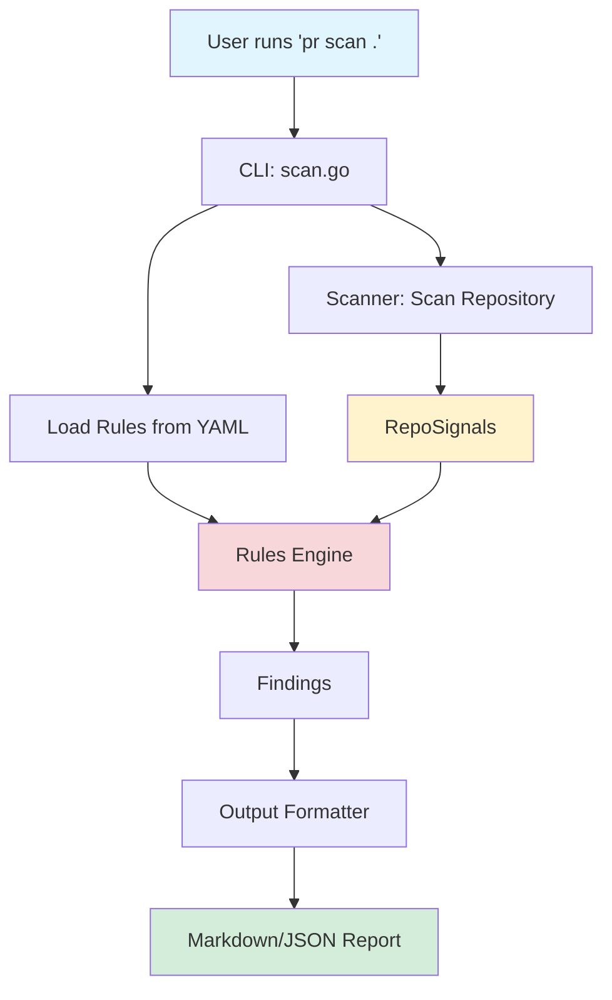
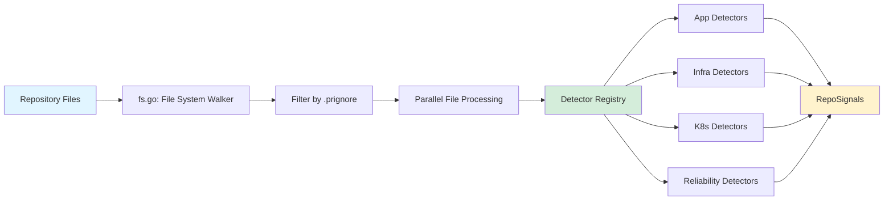
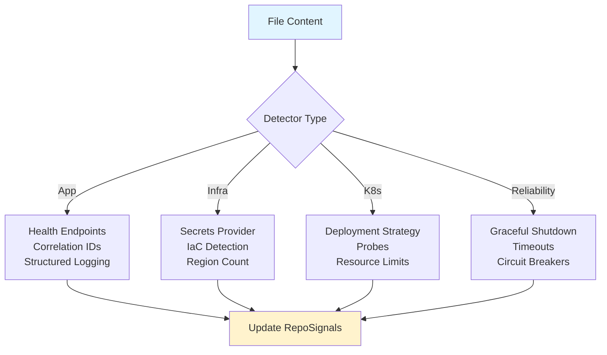
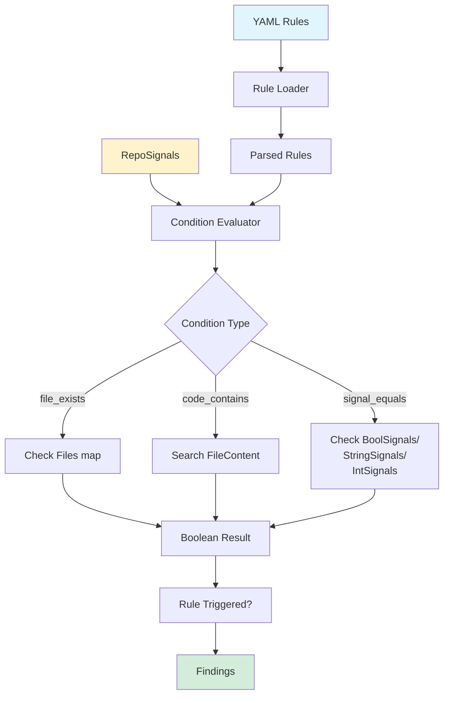
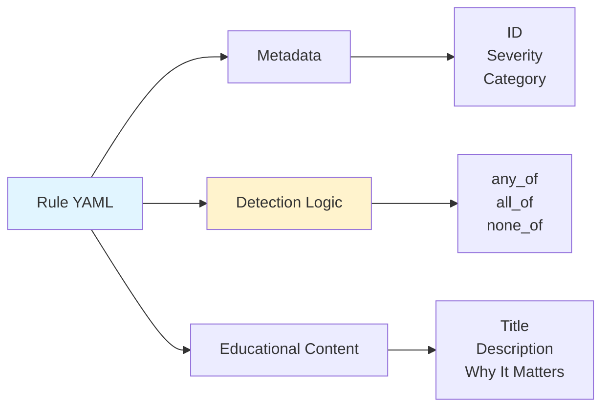
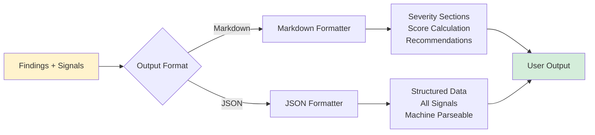
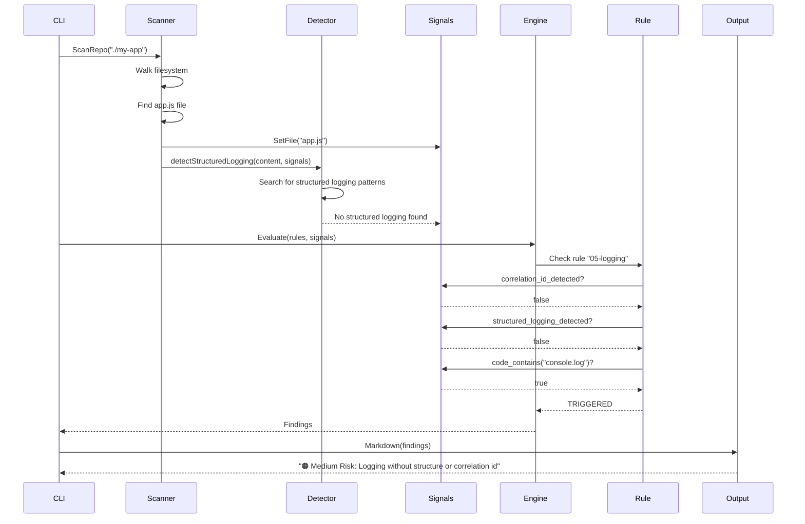

# Architecture

This document describes the internal architecture of **production-readiness** and how data flows through the system.

---

## High-Level Flow



The tool follows a **pipeline architecture**:

1. **Load Rules** — Parse YAML rule definitions
2. **Scan Repository** — Walk filesystem and extract signals
3. **Evaluate Rules** — Match signals against rule conditions
4. **Generate Report** — Format findings as Markdown or JSON

---

## Detailed Architecture

### 1. Scanner Module (`internal/scanner/`)

The scanner is responsible for **extracting signals** from the repository.



#### Key Components

| Component | Purpose |
|-----------|---------|
| **fs.go** | Walks the repository filesystem, respects `.prignore`, filters binary files |
| **detector_registry.go** | Manages detector registration and execution |
| **detectors_*.go** | Domain-specific signal extractors (app, infra, K8s, reliability) |
| **signals.go** | Thread-safe data structure holding all detected signals |

#### Signal Types

**RepoSignals** stores multiple types of data:

```go
type RepoSignals struct {
    Files           map[string]bool   // File existence
    FileContent     map[string]string // File contents (text only)
    BoolSignals     map[string]bool   // Boolean flags
    StringSignals   map[string]string // String values
    IntSignals      map[string]int    // Integer values
    DetectedRegions map[string]bool   // Cloud regions
}
```

Examples:
- `BoolSignals["secrets_provider_detected"] = true`
- `StringSignals["k8s_deployment_strategy"] = "RollingUpdate"`
- `IntSignals["region_count"] = 2`

---

### 2. Detector System

Detectors are **pure functions** that scan file content and populate signals.



#### Detector Principles

- **Deterministic** — Same input always produces same output
- **No side effects** — Read-only, no network calls, no file writes
- **Best-effort** — Conservative in claiming presence
- **Thread-safe** — Can run in parallel

#### Example Detector

```go
func detectSecretsProvider(content, relPath string, signals *RepoSignals) {
    if signals.GetBool("secrets_provider_detected") {
        return // Already detected
    }
    
    contentLower := strings.ToLower(content)
    for _, pattern := range patterns.SecretsProviderPatterns {
        if strings.Contains(contentLower, pattern) {
            signals.SetBool("secrets_provider_detected", true)
            return
        }
    }
}
```

---

### 3. Rules Engine (`internal/engine/`)

The rules engine **evaluates conditions** against signals to determine which rules trigger.



#### Rule Evaluation Logic

Rules support three logical operators:

| Operator | Logic | Passes When |
|----------|-------|-------------|
| `any_of` | OR | At least one condition is true |
| `all_of` | AND | All conditions are true |
| `none_of` | NOT | None of the conditions are true |

**Combined Logic:**
```
Rule triggers = none_of_passed AND all_of_passed AND any_of_passed
```

#### Example Rule Evaluation

```yaml
# rules/05-logging.yaml
detect:
  none_of:
    - signal_equals:
        correlation_id_detected: true
    - signal_equals:
        structured_logging_detected: true
  any_of:
    - code_contains: console.log
    - code_contains: println
```

**Evaluation:**
1. Check if correlation ID is NOT detected AND structured logging is NOT detected → `none_of = true`
2. Check if `console.log` OR `println` appears in code → `any_of = true`
3. Result: `true AND true = TRIGGERED`

---

### 4. Rules Definition (`rules/*.yaml`)

Rules are **declarative YAML files** that describe production risks.



#### Rule Structure

```yaml
id: unique-identifier
severity: high | medium | low
category: security | reliability | observability | deployment
title: Human-readable summary

description: >
  What was detected and what it means

why_it_matters:
  - Reason 1: Why this causes production incidents
  - Reason 2: Real-world failure patterns
  - Reason 3: Operational impact

detect:
  any_of:
    - condition1
  all_of:
    - condition2
  none_of:
    - condition3

confidence: high | medium | low
```

---

### 5. Output Module (`internal/output/`)

Formats findings into human-readable or machine-readable reports.



#### Markdown Output Structure

```
Overall Readiness Score: 68 / 100

🔴 High Risk
- [Rule Title]
  Why it matters: ...
  
🟠 Medium Risk
- [Rule Title]
  
🟡 Low Risk
- [Rule Title]

🟢 Good Signals
- [Positive findings]
```

---

## Data Flow Example

Let's trace how a **logging structure** issue is detected:



### Step-by-Step Breakdown

1. **CLI** calls `scanner.ScanRepo("./my-app")`
2. **Scanner** walks the filesystem and finds `app.js` file
3. **Scanner** registers file existence: `signals.SetFile("app.js")`
4. **Scanner** calls all registered detectors with file content
5. **Detector** `detectStructuredLogging()` searches for structured logging patterns
6. **Detector** finds no structured logging library usage
7. **CLI** calls `engine.Evaluate(rules, signals)`
8. **Engine** evaluates rule `05-logging.yaml`:
   - `none_of: signal_equals(correlation_id_detected: true)` → **true**
   - `none_of: signal_equals(structured_logging_detected: true)` → **true**
   - `any_of: code_contains("console.log")` → **true**
   - Combined: **TRIGGERED**
9. **Engine** returns findings to CLI
10. **Output** formatter generates Markdown report
11. **User** sees: "🟠 Medium Risk: Logging without structure or correlation id"

---

## Module Responsibilities

| Module | Responsibility | Does NOT Do |
|--------|---------------|-------------|
| **Scanner** | Extract signals from repository | Evaluate rules, make decisions |
| **Detectors** | Identify specific patterns in code | Determine if pattern is good/bad |
| **Signals** | Store detected facts | Interpret meaning |
| **Rules** | Define what patterns indicate risk | Scan files |
| **Engine** | Match signals to rules | Scan files, format output |
| **Output** | Format findings for humans/machines | Evaluate rules |

This **separation of concerns** makes the system:
- **Testable** — Each module can be tested independently
- **Extensible** — Add new detectors without changing rules
- **Maintainable** — Clear boundaries between components

---

## Extending the System

### Adding a New Detector

1. Create detector function in `internal/scanner/detectors_*.go`
2. Register in `detector_registry.go`
3. Detector populates signals
4. No rule changes needed

### Adding a New Rule

1. Create YAML file in `rules/`
2. Reference existing signals
3. No code changes needed

### Adding a New Condition Type

1. Register condition function in `engine/engine.go` `init()`
2. Use in rule YAML files

---

## Performance Characteristics

- **Parallel scanning** — Uses worker pool (CPU cores × 2)
- **Thread-safe signals** — Mutex-protected concurrent writes
- **Efficient filtering** — `.prignore` and binary file skipping
- **Lazy evaluation** — Detectors exit early if signal already set

### Typical Performance

- **Small repo** (< 100 files): ~100ms
- **Medium repo** (1000 files): ~500ms
- **Large repo** (10,000 files): ~2-3s

---

## Design Principles

1. **Read-only** — Never modifies the repository
2. **Deterministic** — Same repo always produces same results
3. **Explainable** — Every finding links to a rule with explanation
4. **Extensible** — Add detectors and rules without core changes
5. **Fast** — Parallel processing, early exits, efficient filtering
6. **Safe** — Path validation, no arbitrary code execution

---

## Related Documentation

- [Writing Rules](rules.md) — How to create new rule definitions
- [Writing Detectors](detectors.md) — How to add new signal detectors
- [Contributing](contributing.md) — Development workflow and guidelines
